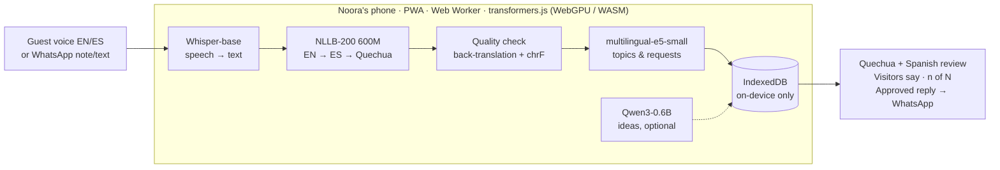

# Finca

**Small AI. In her language. In her pocket.** · **IA pequeña. En su idioma. En su bolsillo.**

Hack-Nation × World Bank — *Small AI for Development*, Annex C: Tourism.
**App:** https://runasimi-feedback.vercel.app · **Technical details / Detalles técnicos:** [docs/TECHNICAL.md](docs/TECHNICAL.md) · **Spec:** [SPEC.md](SPEC.md)

## English

Noora lives in the Andes near Cusco. She farms and hosts tourists in her home, but she speaks Quechua and only a little Spanish, so she can't understand what her guests say about her stay, or answer them.

**Finca** is an offline app (PWA) that lets her:

1. **Collect reviews:** the guest records a voice review in English or Spanish, after giving consent. Voice notes and texts shared from WhatsApp work too.
2. **Read them in Quechua:** Finca transcribes and translates each review on the phone and shows it in Quechua and Spanish. If the Quechua can't be verified, it says "I'm not sure" and shows Spanish.
3. **See what guests say:** topics and requests ("wants to buy coffee", "asks for directions") with counts and the reviews behind them.
4. **Answer:** a ready-made reply for each request, which she completes and approves before WhatsApp opens. Nothing is sent on its own.
5. **Get ideas (optional):** an on-device language model suggests improvements, citing the reviews they come from.

After a one-time download over Wi-Fi, everything runs on the phone, with no internet, no server, and no data leaving the device.

## Español

Noora vive en los Andes, cerca del Cusco. Cultiva su chacra y recibe turistas en su casa, pero habla quechua y solo un poco de castellano, así que no entiende lo que sus huéspedes dicen de su visita ni puede responderles.

**Finca** es una app sin internet (PWA) que le permite:

1. **Recoger reseñas:** el huésped graba su opinión en inglés o castellano, con su consentimiento. También recibe notas de voz y textos compartidos desde WhatsApp.
2. **Leerlas en quechua:** Finca transcribe y traduce cada reseña en el teléfono y la muestra en quechua y castellano. Si el quechua no se puede verificar, dice "No estoy seguro" y muestra el castellano.
3. **Ver qué dicen sus huéspedes:** temas y pedidos ("quiere comprar café", "pregunta cómo llegar") con conteos y las reseñas que los respaldan.
4. **Responder:** una respuesta lista para cada pedido, que ella completa y aprueba antes de que se abra WhatsApp. Nunca se envía nada solo.
5. **Recibir ideas (opcional):** un modelo de lenguaje en el teléfono sugiere mejoras citando las reseñas de donde salen.

Tras una descarga única con wifi, todo corre en el teléfono: sin internet, sin servidor y sin que los datos salgan del dispositivo.

## Architecture / Arquitectura



| | Model / Modelo | Size / Tamaño | License |
| --- | --- | --- | --- |
| Speech to text / Voz a texto | `Xenova/whisper-base` (q8) | 80 MB | MIT |
| Translation / Traducción | `Xenova/nllb-200-distilled-600M` (q8) | 912 MB | CC-BY-NC 4.0 |
| Topics & requests / Temas y pedidos | `Xenova/multilingual-e5-small` (q8) | 135 MB | MIT |
| Ideas (optional / opcional) | `onnx-community/Qwen3-0.6B-ONNX` (q4f16) | 570 MB | Apache 2.0 |

- **Stack:** Vite + React + TypeScript PWA, `@huggingface/transformers` in a Web Worker, IndexedDB, Cache Storage, Vercel.
- **Resumable download / Descarga reanudable:** models are fetched in 8 MB chunks, so the download survives lost signal and low-memory phones. / Los modelos se bajan en trozos de 8 MB: la descarga sobrevive a cortes de señal y a celulares con poca memoria.
- **Languages / Idiomas:** interface in Runasimi, Spanish and English. / Interfaz en runasimi, castellano e inglés.

## Limitations / Limitaciones

- **Quechua variant:** NLLB-200 only covers Ayacucho Quechua (`quy`); Cusco Quechua (`quz`) is close but not supported. / NLLB-200 solo cubre el quechua ayacuchano; el cusqueño es cercano pero no está soportado.
- **Translation quality** is low (chrF 32 on FLORES+), which is why unverified Quechua falls back to Spanish. / La calidad es baja (chrF 32), por eso el quechua no verificado se muestra en castellano.
- **Interface Quechua** is a draft that a native speaker still needs to review. / Los textos en quechua de la interfaz son un borrador que falta revisar con un hablante.
- **Qwen3 ideas** are experimental: in our tests it sometimes copied or invented details. / Las ideas de Qwen3 son experimentales: en las pruebas a veces copiaba o inventaba detalles.
- **NLLB-200** is non-commercial (CC-BY-NC 4.0). / NLLB-200 es de uso no comercial.

Evaluation, datasets and design decisions: [docs/TECHNICAL.md](docs/TECHNICAL.md).

## Run / Ejecutar

```bash
npm install
npm run dev     # http://localhost:5173
```
